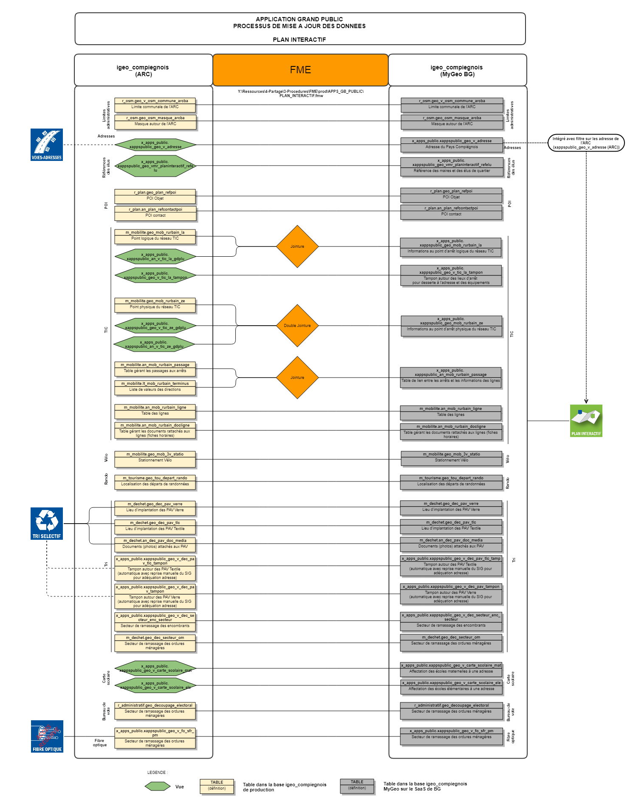

# Documentation d'administration de la base #

## Principes
 * **généralité** :
 Il n'y a pas à proprement dit de base de données propres pour générer l'application grand public Plan Interactif. Il s'agit plutôt d'un transfert de données existantes afin d'être consultable dans une application dédiée à partir d'une recherche d'adresse.
 
 * **résumé fonctionnel** :
Les données exploitées sont soient transférées en l'état ou soient retravaillées (calcul, forme, ...) sous forme de vues applicatives. Les données sont stockées sur un serveur Postgres déporté du prestataire de service GEO. Le transfert des données de la base de production (maitre) de l'Agglomération de la Région de Compiègne et la base déportée (esclave) a lieu tous les jours pendant la nuit. Ainsi les données mises à jour dans la journée sont disponibles le lendemain sur l'application.

## Schéma fonctionnel

## Dépendances (non critiques)

Les dépendances sont liées à chaque donnée transférée.

## Classes d'objets

L'ensemble des classes d'objets de gestion sont stockés pour la plupart dans le schéma x_apps_public. Certaines peuvent être conservées dans les schémas métiers de chaque donnée dans le cas d'un transfert de la donnée brute.

 ### classes d'objets des données brutes et des vues applicatives :
 
 La structure des tables ou des vues ne sera pas détaillée ici puisque qu'il s'agit d'une exploitation brute de données existantes gérées pour d'autres usages. Seules les vues applicatives pourront faire l'objet d'un détail de leur structure.
 
 
- limites adminsitratives :

`r_osm.geo_v_osm_commune_arcba` : Donnée géographique des limites communales de l'Agglomération de la Région de Compiègne
`r_osm.geo_osm_masque_arcba` : Donnée géographique générant un polygone à trou sur l'Agglomération de la Région de Compiègne pour créer un effet masque sur les territroires périphériques.

Particularité(s) à noter : aucune

---

- adresses :

`x_apps_public.xappspublic_geo_v_adresse` : Vue géographique des adresses sur le Pays Compiégnois filtrée dans l'application sur l'Agglomération de la Région de Compiègne.

|Nom attribut | Définition | Type  | Valeurs par défaut | Provenance |
|:---|:---|:---|:---|:---|
|id_adresse|Identifiant de l'adresse|integer||r_objet.geo_objet_pt_adresse|
|id_voie|Identifiant de la voie|integer||r_objet.geo_objet_pt_adresse|
|id_tronc|Identifiant du tronçon|integer||r_objet.geo_objet_pt_adresse|
|numero|numéro sur la voirie|character varying||r_adresse.an_adresse|
|repet|indice de répétition|character varying||r_adresse.an_adresse|
|complement|complément d'adresse|character varying||r_adresse.an_adresse|
|angle|angle de positonnement de l'étiquette par rapport à la voie|character varying||r_adresse.an_adresse|
|libvoie_c|indice de répétition|character varying||r_voie.an_voie|
|insee|code insee de la commune|character varying||r_voie.an_voie|
|codepostal|code postal|character varying||r_administratif.lk_insee_codepostal|
|commune|Libellé de la commune|character varying||r_osm.geo_osm_commune|
|rivoli|code rivoli|character varying||r_voie.an_voie|
|rivoli_cle|cle rivoli|character varying||r_voie.an_voie|
|mot_dir|mot directeur|character varying||r_voie.an_voie|
|position|position du point adresse|character varying||r_objet.lt_position et r_objet.geo_objet_pt_adresse|
|dest_adr|destination de l'adresse|character varying||r_adresse.lt_dest_adr et r_adresse.an_adresse_info|
|etat_adr|état de l'adresse|character varying||r_adresse.lt_etat_adr et r_adresse.an_adresse_info|
|refcad|référence cadastrale|character varying||r_adresse.an_adresse_info|
|nb_log|nombre de logements|character varying||r_adresse.an_adresse_info|
|refcad|référence cadastrale|character varying||r_adresse.an_adresse_info|
|pc|numéro de permis de construire|character varying||r_adresse.an_adresse_info|
|groupee|information si l'adresse est groupée ou non|character varying||r_adresse.lt_groupee et r_adresse.an_adresse_info|
|secondaire|information si l'adresse est une adresse seondaire|character varying||r_adresse.lt_secondaire et r_adresse.an_adresse_info|
|src_adr|source de l'adresse|character varying||r_adresse.lt_src_adr et r_adresse.an_adresse|
|src_geom|référentiel géographique de saisie du point d'adresse |character varying||r_objet.lt_src_geom et r_objet.geo_objet_pt_adresse|
|src_date|date du référentiel géographique|character varying||r_objet.geo_objet_pt_adresse|
|date_sai|date de saisie|character varying||r_objet.geo_objet_pt_adresse|
|date_maj|date de mise à jour|character varying||r_objet.geo_objet_pt_adresse|
|observ|observations diverses|character varying||r_adresse.an_adresse|
|diag_adr|diagnostic de l'adresse|character varying||r_adresse.lt_diag_adr et r_adresse.an_adresse|
|qual_adr|qualité de l'adresse|character varying||r_adresse.lt_qual_adr et r_adresse.an_adresse|
|id_ext1|identifiant base externe 1|character varying||r_adresse.an_adresse_info|
|id_ext2|identifiant base externe 2|character varying||r_adresse.an_adresse_info|
|x_l93|coordonnées X du point d'adresse en Lambert 93|character varying||r_adresse.an_adresse_info|
|y_l93|coordonnées Y du point d'adresse en Lambert 93|character varying||r_adresse.an_adresse_info|
|verif_base|information sur le fait que les données ont été vérifiées|character varying||r_adresse.an_adresse|
|geom|géométrie du point|geometry(point,2154)||r_objet.geo_objet_pt_adresse|

Particularité(s) à noter : aucune

---

- références des élus :

`x_apps_public.xappspublic_geo_vmr_planinteractif_refelu` : Vue matérialisée des élus référents (communes et/ou quartier) sur l'Agglomération de la Région de Compiègne.

|Nom attribut | Définition | Type  | Valeurs par défaut | Provenance |
|:---|:---|:---|:---|:---|
|gid|Identifiant interne|integer||row_number|
|id|Identifiant du quartier|character varying||r_administratif.geo_adm_quartier|
|insee|code insee de la commune|character varying||r_administratif.geo_adm_quartier|
|nom|nom du quartier|character varying||r_administratif.geo_adm_quartier|
|commune|libellé de la commune|character varying||r_administratif.geo_adm_quartier|
|l_logo|nom du fichier image contenant le logo de la commune|character varying||r_administratif.geo_adm_quartier|
|l_m|nom du maire|character varying||r_administratif.an_ref_maire|
|l_m_titre|titre du maire|character varying||r_administratif.an_ref_maire|
|l_m_email|email du maire|character varying||r_administratif.an_ref_maire|
|l_m_tel|téléphone du maire|character varying||r_administratif.an_ref_maire|
|l_m_url|url dusite internet, facebook, ... du maire|character varying||r_administratif.an_ref_maire|
|l_m_photo|nom du fichier image contenant la photo du maire|character varying||r_administratif.an_ref_maire|
|l_er1|nom du 1er élu de quartier|character varying||r_administratif.an_ref_eluquartier|
|l_er_titre1|titre du 1er élu de quartier|character varying||r_administratif.an_ref_eluquartier|
|l_er_email1|email du 1er élu de quartier|character varying||r_administratif.an_ref_eluquartier|
|l_er_tel1|email du 1er élu de quartier|character varying||r_administratif.an_ref_eluquartier|
|l_er_url1|url dusite internet, facebook, ... du 1er élu de quartier|character varying||r_administratif.an_ref_eluquartier|
|l_er_photo1|nom du fichier image contenant la photo du 1er élu de quartier|character varying||r_administratif.an_ref_eluquartier|
|l_er2|nom du 1er élu de quartier|character varying||r_administratif.an_ref_eluquartier|
|l_er_titre2|titre du 2nd élu de quartier|character varying||r_administratif.an_ref_eluquartier|
|l_er_email2|email du 2nd élu de quartier|character varying||r_administratif.an_ref_eluquartier|
|l_er_tel2|email du 2nd élu de quartier|character varying||r_administratif.an_ref_eluquartier|
|l_er_url2|url dusite internet, facebook, ... du 2nd élu de quartier|character varying||r_administratif.an_ref_eluquartier|
|l_er_photo2|nom du fichier image contenant la photo du 2nd élu de quartier|character varying||r_administratif.an_ref_eluquartier|
|l_er3|nom du 3ème élu de quartier|character varying||r_administratif.an_ref_eluquartier|
|l_er_titre3|titre du 3ème élu de quartier|character varying||r_administratif.an_ref_eluquartier|
|l_er_email3|email du 3ème élu de quartier|character varying||r_administratif.an_ref_eluquartier|
|l_er_tel3|email du 3ème élu de quartier|character varying||r_administratif.an_ref_eluquartier|
|l_er_url3|url dusite internet, facebook, ... du 3ème élu de quartier|character varying||r_administratif.an_ref_eluquartier|
|l_er_photo3|nom du fichier image contenant la photo du 3ème élu de quartier|character varying||r_administratif.an_ref_eluquartier|
|geom|attribut de géométrie|geometry(MultiPolygon,2154)||r_administratif.geo_adm_quartier|

Particularité(s) à noter : aucune

---

- POI :

`r_plan.geo_plan_refpoi` : Donnée géographique des POI sur l'Agglomération de la Région de Compiègne.
`r_plan.an_plan_refcontactpoi` : Donnée alphanumérique des contacts des POI sur l'Agglomération de la Région de Compiègne.

Particularité(s) à noter : aucune

---

- Réseau de transport et mobilité :

`m_mobilite.geo_mob_rurbain_la` : Donnée géographique des arrêts logiques du réseau de transoport sur l'Agglomération de la Région de Compiègne(TIC).

`x_apps_public.xappspublic_an_v_tic_la_gdplu` : Vue alphanumérique contenant les données spécifiques pré-traitées (affichage des numéros de lignes par étiquette ou image des n° de lignes par arrêts)  sur les arrêts logiques sur l'Agglomération de la Région de Compiègne pour affichage dans l'application.

|Nom attribut | Définition | Type  | Valeurs par défaut | Provenance |
|:---|:---|:---|:---|:---|
|id_la|Identifiant du point d'arrêt logique|character varying||m_mobilite.geo_mob_rurbain_la|
|nom|libellé de l'arrêt logique|character varying||m_mobilite.geo_mob_rurbain_la|
|n_lu1|numéro ligne urbaine passant à l'arrêt (1 à 6)|character varying||x_apps_public.xappspublic_an_v_tic_la_gdpu_lu_1|
|n_lu2|numéro ligne urbaine passant à l'arrêt (HM ou AE)|character varying||x_apps_public.xappspublic_an_v_tic_la_gdpu_lu_2|
|n_djf|numéro ligne dimanche et jours fériés passant à l'arrêt (D1 et D2)|character varying||x_apps_public.xappspublic_an_v_tic_la_gdpu_djf|
|n_tad|numéro ligne TAD passant à l'arrêt (13 à 20)|character varying||x_apps_public.xappspublic_an_v_tic_la_gdpu_tad|
|n_pu|numéro ligne péri-urbaine passant à l'arrêt |character varying||x_apps_public.xappspublic_an_v_tic_la_gdpu_pu|
|n_sco|numéro ligne scolaire passant à l'arrêt |character varying||x_apps_public.xappspublic_an_v_tic_la_gdpu_sco|
|n_tic|formatage de l'affichage des n° de lignes passant à l'arrêt (ex : 1-4-AE)|character varying||concaténation des vues par type de réseau|
|img_[n° de ligne]|champ contenant l'adresse url de l'image du numéro de ligne|character varying||par condition de n° de lignes passant à l'arrêt inscrit en dure l'url|

Particularité(s) à noter : cette vue est construite à partir d'autres vues du schéma x_apps_public. Leurs structures ne sont pas détaillées ici mais leurs codes SQL intégrées dans le fichier d'initialisation. Cette vue est également exploitée dans le FME permettant d'envoyer les données sur la base esclave (construction d'une autre table).

`x_apps_public.xappspublic_geo_v_tic_la_tampon` : Vue géographique contenant les tampons correspondant aux périmètres d'attraction d'un arrêt de bus pour remonter dans l'applicatif Grand Public les lignes desservant les adresses ou les équipements sur l'Agglomération de la Région de Compiègne.

|Nom attribut | Définition | Type  | Valeurs par défaut | Provenance |
|:---|:---|:---|:---|:---|
|geom2|géométrie des objets|geometry(polygon,2154)||m_mobilite.geo_mob_rurbain_la|

Particularité(s) à noter : cette vue reprend les éléments de la table m_mobilite.geo_mob_rurbain_la sauf pour la géométrie qui est un tampon autour du point d'arrêt définit par la valeur contenue dans le champ `v_tampon`

`x_apps_public.xappspublic_an_v_tic_ze_gdplu` : Vue alphanumérique contenant les données spécifiques pré-traitées (affichage des numéros de lignes par étiquette ou image des n° de lignes par arrêts)  sur les arrêts physiques sur l'Agglomération de la Région de Compiègne pour affichage dans l'application.

|Nom attribut | Définition | Type  | Valeurs par défaut | Provenance |
|:---|:---|:---|:---|:---|
|id_ze|Identifiant du point d'arrêt physique|character varying||m_mobilite.geo_mob_rurbain_ze|
|nom|libellé de l'arrêt physique|character varying||m_mobilite.geo_mob_rurbain_ze|
|n_lu1|numéro ligne urbaine passant à l'arrêt (1 à 6)|character varying||x_apps_public.xappspublic_an_v_tic_ze_gdpu_lu_1|
|n_lu2|numéro ligne urbaine passant à l'arrêt (HM ou AE)|character varying||x_apps_public.xappspublic_an_v_tic_ze_gdpu_lu_2|
|n_djf|numéro ligne dimanche et jours fériés passant à l'arrêt (D1 et D2)|character varying||x_apps_public.xappspublic_an_v_tic_ze_gdpu_djf|
|n_tad|numéro ligne TAD passant à l'arrêt (13 à 20)|character varying||x_apps_public.xappspublic_an_v_tic_ze_gdpu_tad|
|n_pu|numéro ligne péri-urbaine passant à l'arrêt |character varying||x_apps_public.xappspublic_an_v_tic_ze_gdpu_pu|
|n_sco|numéro ligne scolaire passant à l'arrêt |character varying||x_apps_public.xappspublic_an_v_tic_ze_gdpu_sco|
|n_tic|formatage de l'affichage des n° de lignes passant à l'arrêt (ex : 1-4-AE)|character varying||concaténation des vues par type de réseau|
|img_[n° de ligne]|champ contenant l'adresse url de l'image du numéro de ligne|character varying||par condition de n° de lignes passant à l'arrêt inscrit en dure l'url|

Particularité(s) à noter : cette vue est construite à partir d'autres vues du schéma x_apps_public. Leurs structures ne sont pas détaillées ici mais leurs codes SQL intégrées dans le fichier d'initialisation. Cette vue est également exploitée dans le FME permettant d'envoyer les données sur la base esclave (construction d'une autre table).

`x_apps_public.xappspublic_geo_v_tic_ze_gdplu` : Vue géométrique des arrêts physiques avec les lignes en desserte du réseau TIC sur l'Agglomération de la Région de Compiègne.

|Nom attribut | Définition | Type  | Valeurs par défaut | Provenance |
|:---|:---|:---|:---|:---|
|id_ze|identifiant du point d'arrêt|character varying||m_mobilite.geo_mob_rurbain_ze|
|nom|libellé du point d'arrêt|character varying||m_mobilite.geo_mob_rurbain_ze|
|ligne_urbaine|numéro des lignes urbaines en desserte|character varying||x_apps_public.xappspublic_geo_v_tic_ze_gdpu_lu|
|ligne_djf|numéro des lignes dimanches et jours fériés en desserte|character varying||x_apps_public.xappspublic_geo_v_tic_ze_gdpu_djf|
|ligne_pu|numéro des lignes péri-urbaine en desserte|character varying||x_apps_public.xappspublic_geo_v_tic_ze_gdpu_pu|
|ligne_tad|numéro des lignes TAD en desserte|character varying||x_apps_public.xappspublic_geo_v_tic_ze_gdpu_tad|
|ligne_sco|numéro des lignes scolaires en desserte|character varying||x_apps_public.xappspublic_geo_v_tic_ze_gdpu_sco|
|geom|géométrie des objets|geometry(multilinestring,2154)||m_mobilite.geo_mob_rurbain_ze|

Particularité(s) à noter : cette vue est construite à partir d'autres vues du schéma x_apps_public. Leurs structures ne sont pas détaillées ici mais leurs codes SQL intégrées dans le fichier d'initialisation. Cette vue est également exploitée dans le FME permettant d'envoyer les données sur la base esclave (construction d'une autre table).

`m_mobilite.geo_mob_rurbain_ze` : Donnée géographique des arrêts physiques du réseau de transoport sur l'Agglomération de la Région de Compiègne(TIC).
`m_mobilite.an_mob_rurbain_passage` : Donnée alphanumérique gérant les passages aux arrêts physiques du réseau de transoport sur l'Agglomération de la Région de Compiègne(TIC).
`m_mobilite.lt_mob_rurbain_terminus` : Liste de valeur contenant les lieux de terminus ou de passage intermédiaire du réseau de transoport sur l'Agglomération de la Région de Compiègne(TIC).
`m_mobilite.an_mob_rurbain_ligne` : Donnée alphanumérique contenant la liste des lignes du réseau de transoport sur l'Agglomération de la Région de Compiègne(TIC).
`m_mobilite.an_mob_rurbain_docligne` : Donnée alphanumérique contenant les documents relatifs aux lignes du réseau de transoport sur l'Agglomération de la Région de Compiègne(TIC).

Particularité(s) à noter : les données mobilités font l'objet de traitement particulier avant envoi à la base esclave (cf partie sur ETL en bas pour plus de détails).

---

- vélo,rando :

`m_mobilite.geo_mob_3v_station` : Donnée géographique contenant la localisation des stationnements pour vélo sur l'Agglomération de la Région de Compiègne(TIC).
`m_tourisme.geo_tou_depart_rando` : Donnée géographique contenant la localisation des départs de randonnées sur l'Agglomération de la Région de Compiègne(TIC).

Particularité(s) à noter : aucune

---

- tri sélectif et OM : 

`m_dechet.geo_dec_pav_verre` : Donnée géographique contenant la localisation des conteneurs verres sur l'Agglomération de la Région de Compiègne(TIC).
`m_dechet.geo_dec_pav_tlc` : Donnée géographique contenant la localisation des conteneurs textiles, lignes, chaussures sur l'Agglomération de la Région de Compiègne(TIC).
`m_dechet.an_dec_pav_doc_media` : Donnée alphnaumérique contenant les documents joints aux conteneurs (photos) sur l'Agglomération de la Région de Compiègne(TIC).
`m_dechet.geo_dec_secteur_om` : Donnée géoégraphique contenant les secteurs de ramassage des ordures ménagères sur l'Agglomération de la Région de Compiègne(TIC).

Particularité(s) à noter : aucune

`x_apps_public.xappspublic_geo_v_dec_pav_tampon_gdplu` : Vue géographique contenant les tampons correspondant à l'aire d'influence du conteneur à verre (en théorie) sur l'Agglomération de la Région de Compiègne.

|Nom attribut | Définition | Type  | Valeurs par défaut | Provenance |
|:---|:---|:---|:---|:---|
|id_contver|Identifiant du conteneur|integer||m_dechet.geo_dec_pav_verre|
|v_tampon|Valeur du tampon|integer||m_dechet.geo_dec_pav_verre|
|date_effet|date de prise en compte de ce tampon|date||m_dechet.geo_dec_pav_verre|
|geom2|géométrie des objets|geometry(polygon,2154)||m_dechet.geo_dec_pav_verre|

Particularité(s) à noter : certains tampons ont pu être modifiés pour s'adapter à l'emprise. lors de l'automatisation d'envoies des données (car le service déchet est autonome), cette vue n'est plus utilisée. Elle est remplacée par un traitement dans FME qui va déterminer les 2 conteneurs les plus proches de l'adresse sélectionnée (cf partie ETL plus bas pour plus d'informations).

`x_apps_public.xappspublic_geo_v_dec_pav_tlc_tampon_gdplu` : Vue géographique contenant les tampons correspondant à l'aire d'influence du conteneur TLC (en théorie) sur l'Agglomération de la Région de Compiègne.

|Nom attribut | Définition | Type  | Valeurs par défaut | Provenance |
|:---|:---|:---|:---|:---|
|id_cont_tl|Identifiant du conteneur|integer||m_dechet.geo_dec_pav_tlc|
|v_tampon|Valeur du tampon|integer||m_dechet.geo_dec_pav_tlc|
|date_effet|date de prise en compte de ce tampon|date||m_dechet.geo_dec_pav_tlc|
|geom2|géométrie des objets|geometry(polygon,2154)||m_dechet.geo_dec_pav_tlc|

Particularité(s) à noter : certains tampons ont pu être modifiés pour s'adapter à l'emprise. lors de l'automatisation d'envoies des données (car le service déchet est autonome), cette vue n'est plus utilisée. Elle est remplacée par un traitement dans FME qui va déterminer les 2 conteneurs les plus proches de l'adresse sélectionnée (cf partie ETL plus bas pour plus d'informations).

`x_apps_public.xappspublic_geo_v_dec_secteur_enc_secteur` : Vue géométrique contenant les secteurs de rammassage des encombrants  sur l'Agglomération de la Région de Compiègne.

|Nom attribut | Définition | Type  | Valeurs par défaut | Provenance |
|:---|:---|:---|:---|:---|
|gid|Identifiant interne|integer||m_dechet.geo_dec_secteur_enc|
|insee|code insee|character varying||m_dechet.geo_dec_secteur_enc|
|commune|libellé de la commune|character varying||m_dechet.geo_dec_secteur_enc|
|adresse|adresse concernée|character varying||m_dechet.geo_dec_secteur_enc|
|l_secteur|type de secteur|character varying||m_dechet.geo_dec_secteur_enc|
|l_message1|message 1 pour affichage dans GEO|character varying||m_dechet.geo_dec_secteur_enc|
|l_message2|mpassage 2 pour affichage dans GEO|character varying||m_dechet.geo_dec_secteur_enc|
|geom|gémétrie des objets|geometry(polygon,2154)||m_dechet.geo_dec_secteur_enc|

Particularité(s) à noter : une adresse spécifique peut-être un secteur car sur Compiègne il y a des particularités liées à la collecte.

---

- secteurs scolaires :

`x_apps_public.xappspublic_geo_v_carte_scolaire_mat` : Vue géométrique contenant les informations de la carte scolaire pour les écoles maternelles sur l'Agglomération de la Région de Compiègne. Cette donnée permet de remonter l'école assignée à l'adresse saisie dans l'application.

|Nom attribut | Définition | Type  | Valeurs par défaut | Provenance |
|:---|:---|:---|:---|:---|
|gid|Identifiant interne|integer||row_number|
|id_adresse|Identifiant de l'adresse|integer||x_apps.xapps_geo_vmr_adresse|
|id|Identifiant interne du secteur scolaire|integer||r_administratif.geo_carte_scolaire|
|id_poi_mat|Identifiant du POI correspondant à l'école|character varying||r_administratif.lk_cscomat_poi|
|affiche_mat|formatage d'un message reprenant l'école de rattachement ou un autre message d'informations|character varying||sur condition de l'id_poi affiche nom de l'école ou message en dur|

`x_apps_public.xappspublic_geo_v_carte_scolaire_ele` : Vue géométrique contenant les informations de la carte scolaire pour les écoles élémentaires sur l'Agglomération de la Région de Compiègne. Cette donnée permet de remonter l'école assignée à l'adresse saisie dans l'application.

|Nom attribut | Définition | Type  | Valeurs par défaut | Provenance |
|:---|:---|:---|:---|:---|
|gid|Identifiant interne|integer||row_number|
|id_adresse|Identifiant de l'adresse|integer||x_apps.xapps_geo_vmr_adresse|
|id|Identifiant interne du secteur scolaire|integer||r_administratif.geo_carte_scolaire|
|id_poi_ele|Identifiant du POI correspondant à l'école|character varying||r_administratif.lk_cscomat_poi|
|affiche_ele|formatage d'un message reprenant l'école de rattachement ou un autre message d'informations|character varying||sur condition de l'id_poi affiche nom de l'école ou message en dur|

`x_apps_public.xappspublic_an_dec_pavtlc_adr_proxi` : table alphanumérique contenant les informations de proximités des conteneurs TLC pour chaque adresse (les 2 plus près). 

|Nom attribut | Définition | Type  | Valeurs par défaut | Provenance |
|:---|:---|:---|:---|:---|
|gid|Identifiant interne|integer||traitement FME|
|id_adresse|Identifiant de l'adresse|integer||traitement FME|
|id_cont_tl|Identifiant du conteneur|character varying||traitement FME|
|distance|distance entre le point d'adresse et le point du conteneur|numeric||traitement FME|
|ordre|ordre de tri pour le 1er et 2nd|integer||traitement FME|

Particularité(s) à noter : cette table n'est pas stockée dans la base de production mais directement envoyée par un Workflow FME dans la base esclave.

`x_apps_public.xappspublic_an_dec_pavverre_adr_proxi` : table alphanumérique contenant les informations de proximités des conteneurs VERRE pour chaque adresse (les 2 plus près). 

|Nom attribut | Définition | Type  | Valeurs par défaut | Provenance |
|:---|:---|:---|:---|:---|
|gid|Identifiant interne|integer||traitement FME|
|id_adresse|Identifiant de l'adresse|integer||traitement FME|
|id_contver|Identifiant du conteneur|character varying||traitement FME|
|distance|distance entre le point d'adresse et le point du conteneur|numeric||traitement FME|
|ordre|ordre de tri pour le 1er et 2nd|integer||traitement FME|

Particularité(s) à noter : cette table n'est pas stockée dans la base de production mais directement envoyée par un Workflow FME dans la base esclave.

---

- Bureau de vote :

`r_adminsitratif.geo_decoupage_electoral` : Donnée géographique contenant le découpage électoral dans les communes de l'Agglomération de la Région de Compiègne(TIC).

Particularité(s) à noter : certaines communes ne sont pas renseignées.

-- Fibre optique :

`x_apps_public.xappspublic_geo_v_fo_sfr_pm` : Vue géométrique contenant les secteurs de PM et les informations liées à l'avancement de la fibre optioque sur l'Agglomération de la Région de Compiègne.

|Nom attribut | Définition | Type  | Valeurs par défaut | Provenance |
|:---|:---|:---|:---|:---|
|mdate_maj|date maximum |geometry(polygon,2154)||m_mobilite.geo_mob_rurbain_la|

Particularité(s) à noter : cette vue reprend les éléments de la table m_reseau_sec.geo_fo_sfr_pm sauf pour la date maximum de mise à jour contenue dans les données.

---

## Liste de valeurs

Sans objet

---

## Traitement automatisé mis en place (Workflow de l'ETL FME)

Un worflow FME a été réalisé permettant de gérer l'envoi automatique des données vers la base esclave. Il est stockée ici Y:\Ressources\4-Partage\3-Procedures\FME\prod\APPS_GB_PUBLIC\PLAN_INTERACTIF.fmw.
Ce Workflowest exécuté toutes les nuits via une tache planifiée sur le serveur sig-applis.

|Nom de la couche | mise à jour journalière |type d'envoi | traitement FME réalisé |
|:---|:---|:---|
|r_osm.geo_osm_commune_arcba|non|brute|aucun|
|r_osm.geo_osm_masque_arcba|non|brute|aucun|
|x_apps_public.x_appspublic_geo_v_adresse|oui|brute|aucun|
|x_apps_public.x_appspublic_geo_vmr_adresse|oui|brute|aucun|
|x_apps_public.x_appspublic_geo_vmr_planinteractif_refelu|non|brute|aucun|
|r_plan.geo_plan_refpoi|oui|brute|aucun|
|r_plan.an_plan_refcontactpoi|oui|brute|aucun|

Aucune fiche de procédures n'a été réalisée.

---

## Projet QGIS pour la gestion

Sans objet
       
## Export Open Data

Sans objet

---

## Modèle conceptuel simplifié
Sans objet
